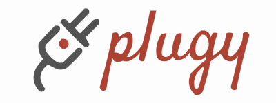

[![GitHub Actions][github-actions-badge]](https://github.com/geofmureithi/plugy/actions)
[![GitHub Releases][github-release-svg]][github-release]

# plugy

plugy is a plugin system designed to enable the seamless integration of Rust-based plugins into your application. It provides a runtime environment for loading and executing plugins written in WebAssembly (Wasm), enabling dynamic extensibility and modularity in your Rust projects.

## Features

- Load and execute plugins compiled to WASM.
- Flexible runtime management of plugins.
- Calls to plugin functions are async.
- Easy-to-use macros for generating plugin interfaces.

## Getting Started

To use plugy in your Rust project, follow these steps:

1. Write your plugin trait:

```rust
#[plugy::plugin]
trait Greeter {
    fn greet(&self) -> String;
}
```

2. Write your first plugin implementation

```rust
#[derive(Debug, Deserialize)]
struct FooPlugin;

#[plugin_impl]
impl Greeter for FooPlugin {
    fn greet(&self) -> String {
        "Hello From Foo Plugin".to_owned()
    }
}
```

Compile it!

```
cargo build --target wasm32-unknown-unknown
```

3. Import and run

```rust
#[plugin_import(file = "target/wasm32-unknown-unknown/debug/foo_plugin.wasm")]
struct FooPlugin;

#[tokio::main]
async fn main() {
    let runtime = Runtime::<Box<dyn Greeter>>::new().unwrap();
    let handle = runtime.load(FooPlugin).await.unwrap();
    let res = handle.greet().await;
    assert_eq!(res, "Hello From Foo Plugin")
}
```

And you are set!

## Examples

Check out the [examples](./examples/) directory for sample usage of plugy.

## Milestones

| Status | Goal                                                                                                | Labels     |
| :----: | :-------------------------------------------------------------------------------------------------- | ---------- |
|   ✅   | [accept multiple arity (n-ary) in plugin functions](https://github.com/geofmureithi/plugy/issues/2) | `complete` |
|   ✅   | [pass down context between host and guest](https://github.com/geofmureithi/plugy/issues/3)          | `pending`  |

## Functionality

Plugy comprises three fundamental crates, each serving a distinct role in crafting dynamic plugin systems with Rust and WebAssembly:
- core: This crate houses essential components such as bitwise utilities and the guest module, forming the foundation of Plugy's functionality.

- runtime: The runtime crate orchestrates the execution of your plugin system, allowing seamless integration of plugins into your applications.

- macros: The macros crate offers a collection of macros that simplify the generation of bindings and interfaces, streamlining the process of working with dynamic plugins.

## Contributing

Contributions to plugy are welcome! If you find a bug or want to propose a new feature, feel free to create an issue or submit a pull request.

### Thanks to

- [Wasmtime](https://wasmtime.dev/)
- Bincode
- Serde

License

This project is licensed under the GNU General Public License.

<!-- Badges -->

[github-actions-badge]: https://github.com/geofmureithi/plugy/actions/workflows/build.yml/badge.svg
[github-release]: https://github.com/geofmureithi/plugy/releases
[github-release-svg]: https://img.shields.io/github/release/geofmureithi/plugy.svg
